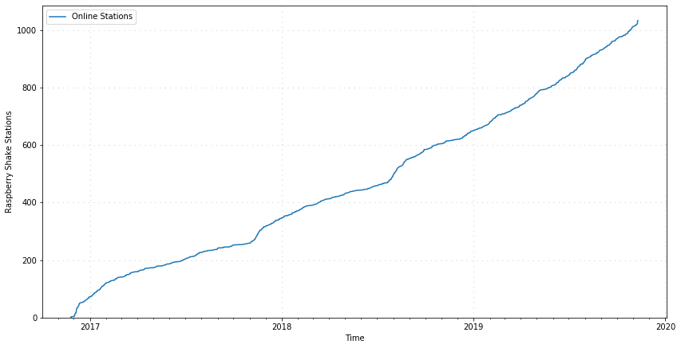

# stationcount
Time series graphs of currently active stations (and all-time active stations) in the Raspberry Shake network.



Required software:
- Python 3
- Jupyter
- Matplotlib
- Obspy
- Pandas

Installation via Anaconda:
```bash
# install the environment with the correct software:
conda create -n stationcount python=3 jupyter matplotlib obspy pandas
# activate the environment
conda activate stationcount
# start Jupyter Notebook
jupyter-notebook
```
Then, navigate to this repository and open one of the two `.ipynb` files.
